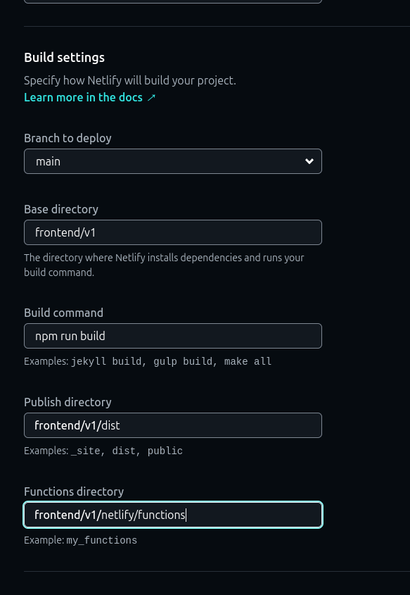

```
.
├── backend
│   └── v1
│       ├── Dockerfile
│       ├── .env.example
│       ├── package.json
│       ├── src
│       │   ├── app.js
│       │   ├── config
│       │   │   └── .gitkeep
│       │   ├── controllers
│       │   │   └── .gitkeep
│       │   ├── db
│       │   │   └── .gitkeep
│       │   ├── index.js
│       │   ├── middlewares
│       │   │   └── .gitkeep
│       │   ├── models
│       │   │   └── .gitkeep
│       │   ├── routes
│       │   │   └── .gitkeep
│       │   ├── services
│       │   │   └── .gitkeep
│       │   ├── utils
│       │   │   └── .gitkeep
│       │   └── validations
│       │       └── .gitkeep
│       └── tests
│           ├── integration
│           │   └── .gitkeep
│           └── unit
│               └── .gitkeep
├── docker-compose.yml
├── docs
│   ├── seo.md
│   └── svit-sitemap.md
├── .eslintrc.js
├── frontend
│   └── v1
│       ├── bundle-stats.html
│       ├── dist
│       │   ├── assets
│       │   │   ├── Archivement-BUPZF6CB.js
│       │   │   ├── framer-D0C5s3XC.js
│       │   │   ├── HomeSideBar-DANzi1aU.js
│       │   │   ├── HoverRow-XXZ3yrUQ.js
│       │   │   ├── ImgText-BLVPwoQR.js
│       │   │   ├── index-BfvYb2K2.css
│       │   │   ├── index-D_6xcdtA.js
│       │   │   ├── Minor_Major-DNgfezNl.js
│       │   │   ├── News-CmO4PS_C.js
│       │   │   ├── PreDesk-CR2hAPv0.js
│       │   │   ├── react-D3F3s8fL.js
│       │   │   ├── router-DryIE7FQ.js
│       │   │   ├── StudentDiversity-IICEOmiM.js
│       │   │   ├── svit-building-1-D1eAj_5J.webp
│       │   │   ├── svit-building-2-C8kTANIS.webp
│       │   │   ├── svit-building-3-BUOzmidM.webp
│       │   │   ├── svit-building-4-CPoiNJ4C.webp
│       │   │   ├── svitlogo-CM7df9e1.webp
│       │   │   ├── svit-principle-DPIkJ0G2.webp
│       │   │   ├── Useful-Cg0MTJBE.js
│       │   │   └── WT-C6JHI5p2.js
│       │   ├── index.html
│       │   ├── robots.txt
│       │   ├── sitemap.xml
│       │   └── vite.svg
│       ├── eslint.config.js
│       ├── .gitignore
│       ├── index.html
│       ├── package.json
│       ├── package-lock.json
│       ├── public
│       │   ├── robots.txt
│       │   ├── sitemap.xml
│       │   └── vite.svg
│       ├── README.md
│       ├── src
│       │   ├── App.css
│       │   ├── App.jsx
│       │   ├── assets
│       │   │   ├── carsusel
│       │   │   │   ├── svit-building-1.webp
│       │   │   │   ├── svit-building-2.webp
│       │   │   │   ├── svit-building-3.webp
│       │   │   │   └── svit-building-4.webp
│       │   │   ├── saheb.webp
│       │   │   ├── svitlogo.webp
│       │   │   └── svit-principle.webp
│       │   ├── Components
│       │   │   ├── About
│       │   │   │   ├── AboutAdmission.jsx
│       │   │   │   ├── AboutcourseOffered.jsx
│       │   │   │   ├── AboutCurriculumSyllabus.jsx
│       │   │   │   ├── AboutEligibility.jsx
│       │   │   │   ├── AbouteSocietyTable.jsx
│       │   │   │   ├── AboutFeesDetail.jsx
│       │   │   │   ├── AboutInception.jsx
│       │   │   │   ├── AboutInfrastructure.jsx
│       │   │   │   ├── AboutLinkages.jsx
│       │   │   │   ├── AboutPrincipleImg.jsx
│       │   │   │   ├── AboutPrinciple.jsx
│       │   │   │   ├── AboutSisebar.jsx
│       │   │   │   ├── AboutSociety.jsx
│       │   │   │   ├── AimObjective.jsx
│       │   │   │   ├── BalasahebIntro.jsx
│       │   │   │   ├── CampusInfo.jsx
│       │   │   │   ├── Campus.jsx
│       │   │   │   ├── CurriculumSyllabus.jsx
│       │   │   │   ├── Hostel.jsx
│       │   │   │   ├── Linkages.jsx
│       │   │   │   ├── MissionVissionAO.jsx
│       │   │   │   ├── Placement.jsx
│       │   │   │   ├── PrincipleDesk.jsx
│       │   │   │   ├── SilentFeaucture.jsx
│       │   │   │   ├── VissionMission.jsx
│       │   │   │   ├── VitthalraoIntro.jsx
│       │   │   │   └── wholeSociety.jsx
│       │   │   ├── Admission
│       │   │   │   ├── CoursesOffered .jsx
│       │   │   │   └── MainAdmission.jsx
│       │   │   ├── ContactUs
│       │   │   │   ├── ContactPulse.jsx
│       │   │   │   ├── Contactus.jsx
│       │   │   │   └── MainContactUs.jsx
│       │   │   ├── department
│       │   │   │   ├── Departmentinfo.jsx
│       │   │   │   ├── department.jsx
│       │   │   │   ├── HeroCarousel.jsx
│       │   │   │   ├── Hod.jsx
│       │   │   │   ├── SidebarHod.jsx
│       │   │   │   └── Sidebar.jsx
│       │   │   ├── Examination
│       │   │   │   ├── ExaminationDepartment.jsx
│       │   │   │   ├── ExaminationFaculty.jsx
│       │   │   │   ├── Examination.jsx
│       │   │   │   └── ExaminationLink.jsx
│       │   │   ├── Footer.jsx
│       │   │   ├── galary
│       │   │   │   ├── Galary.jsx
│       │   │   │   ├── MainGalary.jsx
│       │   │   │   └── WelcomeGalary.jsx
│       │   │   ├── Header.jsx
│       │   │   ├── Home
│       │   │   │   ├── Archivement.jsx
│       │   │   │   ├── Home.jsx
│       │   │   │   ├── HomeSideBar.jsx
│       │   │   │   ├── HoverRow.jsx
│       │   │   │   ├── ImgText.jsx
│       │   │   │   ├── Minor&Major.jsx
│       │   │   │   ├── News.jsx
│       │   │   │   ├── PreDesk.jsx
│       │   │   │   ├── StudentDiversity.jsx
│       │   │   │   ├── Useful.jsx
│       │   │   │   └── WT.jsx
│       │   │   ├── HomeNav.jsx
│       │   │   ├── Library
│       │   │   │   ├── AdvisoryCommittee.jsx
│       │   │   │   ├── CentralLibrary.jsx
│       │   │   │   ├── DepartmentWiseReport.jsx
│       │   │   │   ├── EResources.jsx
│       │   │   │   ├── Faculty.jsx
│       │   │   │   ├── LibraryAdvisoryComitee.jsx
│       │   │   │   ├── LibraryFacilities.jsx
│       │   │   │   ├── LibraryFaculty.jsx
│       │   │   │   ├── LibraryInfo.jsx
│       │   │   │   ├── Library.jsx
│       │   │   │   ├── LibraryObjectives.jsx
│       │   │   │   ├── LibrarySection.jsx
│       │   │   │   ├── LibrarySydebar.jsx
│       │   │   │   ├── Section.jsx
│       │   │   │   ├── TotalReport.jsx
│       │   │   │   └── WelcomeLibrary.jsx
│       │   │   ├── SideBar
│       │   │   │   ├── Academic.jsx
│       │   │   │   ├── AccordionItem.jsx
│       │   │   │   ├── AnimatedList.jsx
│       │   │   │   ├── Course.jsx
│       │   │   │   ├── E-resources.jsx
│       │   │   │   ├── Events.jsx
│       │   │   │   ├── faculty.jsx
│       │   │   │   ├── Labs.jsx
│       │   │   │   ├── Outcome.jsx
│       │   │   │   ├── Placement.jsx
│       │   │   │   ├── Result.jsx
│       │   │   │   └── Syllabus.jsx
│       │   │   ├── Sidebar-Constants
│       │   │   │   ├── chemDept.js
│       │   │   │   ├── csDept.js
│       │   │   │   ├── eceDept.js
│       │   │   │   ├── feDept.js
│       │   │   │   ├── itDept.js
│       │   │   │   └── mbaDept.js
│       │   │   └── viewCounter
│       │   │       └── viewCounter.jsx
│       │   ├── Constants
│       │   │   ├── chemicalEngineering.js
│       │   │   ├── computerEngineering.js
│       │   │   ├── department.config.js
│       │   │   ├── electronicsAndComputerEngineering.js
│       │   │   ├── firstYear.js
│       │   │   ├── home.js
│       │   │   ├── informationTechnology.js
│       │   │   └── mba.js
│       │   ├── index.css
│       │   ├── main.jsx
│       │   └── seo
│       │       ├── seo.config.js
│       │       └── SEO.jsx
│       └── vite.config.js

├── package.json
├── .prettierrc
├── .prettierrc.json
├── README.md
├── shared
│   ├── package.json
│   ├── src
│   │   ├── types
│   │   │   └── .gitkeep
│   │   └── utils
│   │       └── .gitkeep
│   └── tsconfig.json
├── structure.txt
└── tsconfig.base.json

322 directories, 868 files

```

